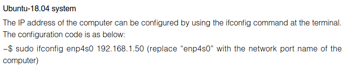
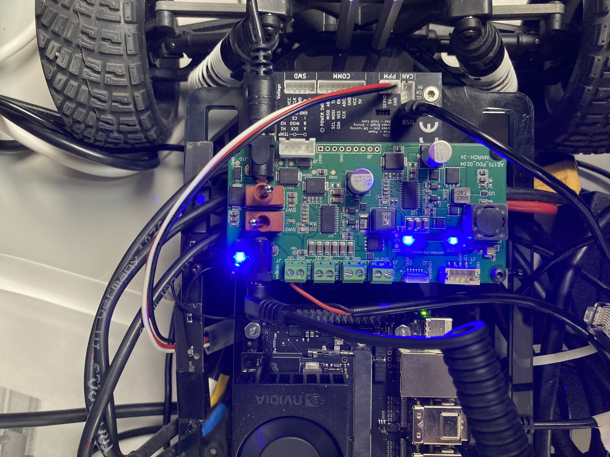
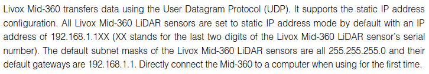
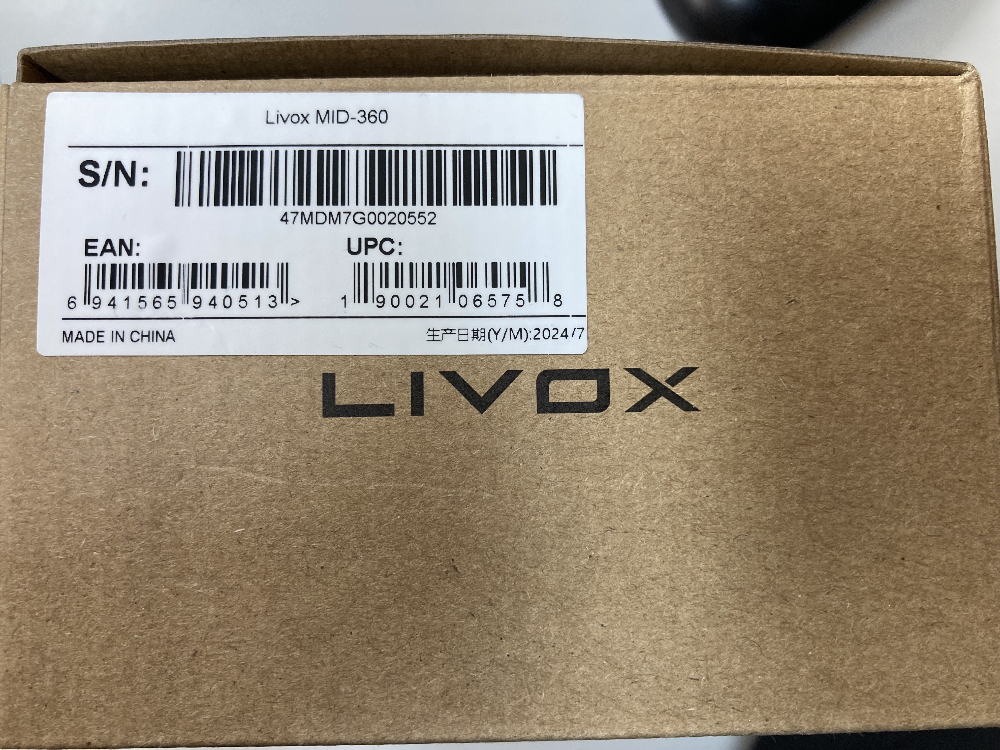

# This file contains the instructions to use livox lidar on f1tenth-offroad

Welcome to this repository. This repo includes the adaptations and installations to be done to use the Livox Mid-360 lidar along with f1tenth_system

---

## Steps

##### `STEP 1: Install f1tenth driver stack`

- Install the f1tenth driver stack from using the instructions given in the following [link](https://f1tenth.readthedocs.io/en/foxy_test/getting_started/firmware/drive_workspace.html#setting-up-the-driver-stack)

- Please make the following changes before building the ROS package

    - Go to the following directory to access the file `bringup_launch.py`

    - `Path:` \$HOME/ros2_ws/src/f1tenth_system/f1tenth_stack/launch/bringup_launch.py

    - Comment out the following lines to make sure the nodes corresponding to the `Hokuyo` are `NOT` launched during bringup.
        ```
        # urg_node = Node(
        #     package='urg_node',
        #     executable='urg_node_driver',
        #     name='urg_node',
        #     parameters=[LaunchConfiguration('sensors_config')]
        # )
        ```
        ```
        # ld.add_action(urg_node)
        ```
    - Now build the package using `colcon build`

    - Test whether the `bringup_launch.py` is working and test the working using a controller

##### `STEP 2: Install the Livox-SDK2`

- Install the `Livox-SDK2` using the following [link](https://github.com/Livox-SDK/Livox-SDK2/blob/master/README.md). Please use the `linux` installation steps ([link](https://github.com/Livox-SDK/Livox-SDK2/blob/master/README.md#22-instruction-for-ubuntu-2004))

- If you are having issue with the build process, try using less number of cpus using the following command
    ```
    cmake .. && make -jX, where X = desired number of CPUs
    ```
- Follow the instruction given in this link to add the path for livox binaries from this [link](https://github.com/Livox-SDK/livox_ros_driver2?tab=readme-ov-file#62-launch-with-command-ros2-launch-livox_lidar_rviz_hap_launchpy-but-cannot-open-shared-object-file-liblivox_sdk_sharedso-)

    ```
    vim ~/.bashrc
    export LD_LIBRARY_PATH=${LD_LIBRARY_PATH}:/usr/local/lib
    source ~/.bashrc
    ```

##### `STEP 3: Configuring the static ip address on host and connecting livox` 

- Refer to the following `Livox_Mid-360_User_Manual_EN` ([link](https://terra-1-g.djicdn.com/851d20f7b9f64838a34cd02351370894/Livox/Livox_Mid-360_User_Manual_EN.pdf)) 

- Setup the `static IP address` of the host computer
<p align="center">
    
</p

    - Find the `ethernet_port_name` using `ifconfig` 

    ```
    sudo ifconfig <ethernet_port_name> 192.168.1.50    
    ```

- Connect the power cable of the lidar to power board (`12V` - red wire; `GND` - black wire)

<p align="center">
    
</p

##### `STEP 4: Install the livox ROS driver`

- Identify the `static IP address` for configuring the Livox Mid-360.
<p align="center">
    
</p

<p align="center">
    
</p

- Use the instructions for installing the `livox_ros_driver2` using this [link](https://github.com/Livox-SDK/livox_ros_driver2)

- Before building the ROS2 driver, please change the `MID360_config.json` in the following location - `<your-livox-ws>/src/livox_ros_driver2/config/MID360_config.json`

    ```
    "host_net_info" : {
      "cmd_data_ip" : "192.168.1.50",
      "cmd_data_port": 56101,
      "push_msg_ip": "192.168.1.50",
      "push_msg_port": 56201,
      "point_data_ip": "192.168.1.50",
      "point_data_port": 56301,
      "imu_data_ip" : "192.168.1.50",
      "imu_data_port": 56401,
      "log_data_ip" : "",
      "log_data_port": 56501
    }
    ```

    ```
    "lidar_configs" : [
        {
        "ip" : "192.168.1.152",
        "pcl_data_type" : 1,
        "pattern_mode" : 0,
        "extrinsic_parameter" : {
            "roll": 0.0,
            "pitch": 0.0,
            "yaw": 0.0,
            "x": 0,
            "y": 0,
            "z": 0
        }
        }
    ]
    ```
- Build the `livox_ros_driver2` package.